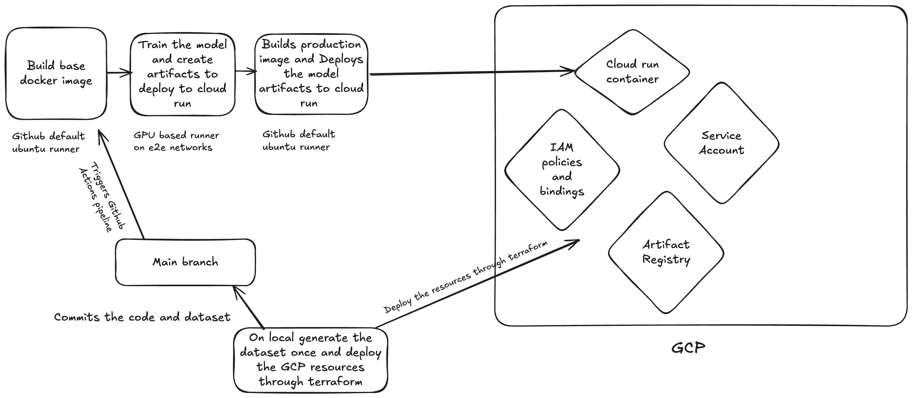

# DevOps Chatbot - AI-Powered DevOps Assistant

An intelligent chatbot that answers DevOps-related questions using a fine-tuned DistilBERT model. Built with FastAPI, React, and deployed on Google Cloud Run.


## Features

- **High Accuracy:** 96.5% accuracy on test set across 10 DevOps intents
- **Context-Aware:** Provides detailed, scenario-specific answers
- **Comprehensive Coverage:** Kubernetes, Docker, CI/CD, Terraform, and more
- **Production Ready:** Deployed on Google Cloud Run with auto-scaling
- **MLOps Pipeline:** Automated training and deployment via GitHub Actions

---


### Sample Questions:

```
# Try asking:
- "What is Kubernetes?"
- "How does Docker work?"
- "What is CI/CD pipeline?"
- "Explain Terraform"
- "How to monitor applications?"
```

### Expected Response:
```
{
  "question": "What is Kubernetes?",
  "intent": "kubernetes_basics",
  "answer": "Kubernetes is an open-source container orchestration platform...",
  "confidence": 0.989
}
```

---

## Architecture

```
┌─────────────────────────────────────────────────────────────┐
│                     User Interface (React)                   │
│          https://devops-chatbot.run.app/                    │
└─────────────────────────────────────────────────────────────┘
                            ↓
┌─────────────────────────────────────────────────────────────┐
│              FastAPI Backend (Cloud Run)                     │
│  ┌─────────────────────────────────────────────────────┐   │
│  │  POST /predict - Intent Classification              │   │
│  │  GET  /health  - Health Check                       │   │
│  │  GET  /        - Serve React UI                     │   │
│  └─────────────────────────────────────────────────────┘   │
└─────────────────────────────────────────────────────────────┘
                            ↓
┌─────────────────────────────────────────────────────────────┐
│          DistilBERT Model (67M parameters)                   │
│  ┌─────────────────────────────────────────────────────┐   │
│  │  Input: Tokenized Question                          │   │
│  │  Process: Transformer Layers                        │   │
│  │  Output: Intent + Confidence Score                  │   │
│  └─────────────────────────────────────────────────────┘   │
└─────────────────────────────────────────────────────────────┘
```

---

## Tech Stack

### Backend
- **Framework:** FastAPI 0.104+
- **ML Model:** DistilBERT (Hugging Face Transformers)
- **Model Size:** 268 MB (67M parameters)
- **Python:** 3.11+

### Frontend
- **Framework:** React 18
- **Build Tool:** Create React App
- **Styling:** CSS3

### Infrastructure
- **Deployment:** Google Cloud Run
- **Terraform:** Deploying GCP resources like Artifactory,IAM roles & permissions etc.
- **CI/CD:** GitHub Actions
- **GPU Training:** E2E Networks vGPU instance
- **Container:** Docker

### Data
- **Sources:** Stack Overflow, GPT-4o, Template Generation
- **Training Samples:** 10,343
- **Validation:** 1,293
- **Test:** 1,293

---

## Installation

### Prerequisites

- Python 3.11+
- Node.js 18+
- Docker (optional)
- GPU with CUDA (for training)
- 4GB+ RAM

### 1. Clone Repository

```
git clone https://github.com/YOUR_USERNAME/devops-chatbot.git
cd devops-chatbot
```

### 2. Backend Setup

```
# Create virtual environment
python -m venv venv
source venv/bin/activate  # On Windows: venv\Scripts\activate

# Install dependencies
pip install -r requirements.txt

# Download pre-trained model (if not training from scratch)
# Model should be in models/distilbert-devops-faq/
```

### 3. Frontend Setup

```
cd frontend

# Install dependencies
npm install

# Build production version
npm run build

cd ..
```

### 4. Verify Installation

```
# Test imports
python -c "import torch; import transformers; print('All dependencies installed')"
```

---

## Usage

### Option 1: Run Locally (Development)

#### Training Your Own Model

###### 1. Data Preparation

```
# Option A: Use existing data
python src/data_preparation.py

# Option B: Generate new data (requires OpenAI API key)
export OPENAI_API_KEY="sk-your-key-here"
python src/generate_synthetic_data.py
python src/data_preparation.py
```

###### 2. Train Model
```
python3 src/train.py
```

###### 3. Start the fast API server
```
python3 src/app.py
```

if you see any problem in starting locally related to 

```
    from src.inference import DevOpsChatbot
ModuleNotFoundError: No module named 'src'
```

Then change the import in the app.py 
```
from src.inference import DevOpsChatbot 
to
from inference import DevOpsChatbot 
```

---

### Option 2: How Production Deployment is done through the pipeline

1. Deployed resources through terraform

```
cd terraform
terraform init
terraform plan
terraform apply
```

2. Generate the data <br>
Set OPENAI_API_KEY to your key if you have a one so the data generation uses both stackoverflow scraping and the OPENAI to generate the dataset. This step needs to be done from your local machine and only once. Dataset needs to be committed in the repo. It will be generated at the path **data/raw/devops_faqs.yaml**.

```
python3 src/generate_synthetic_data.py
```

3. Copied the JSON key to authenticate the E2E network's runner to GCP

```
terraform output -raw github_actions_sa_key | base64 -d > github-actions-key.json
```

Create a Github pipeline variable named GCP_SA_KEY and paste the value. Also create a new variable GCP_PROJECT_ID and set value as your GCP project ID

4. Commit in the main branch will trigger the pipeline which will take care of everything else.

```
┌─────────────────────────────────────────────────────────────────────┐
│                    GITHUB ACTIONS CI/CD PIPELINE                     │
│                     DevOps Chatbot Deployment                        │
└─────────────────────────────────────────────────────────────────────┘

                            TRIGGER
                              │
                    ┌─────────┴─────────┐
                    │  Push to 'main'   │
                    │  branch detected  │
                    └─────────┬─────────┘
                              │
                              ▼
                    ┌──────────────────────┐
                    │   CHECKOUT CODE      │
                    │ actions/checkout@v3  │
                    └──────────┬───────────┘
                              │
                              ▼
              ┌───────────────────────────────────┐
              │   AUTHENTICATE TO GOOGLE CLOUD    │
              │  google-github-actions/auth@v1    │
              │  - Setup service account          │
              │  - Configure credentials          │
              └───────────────┬───────────────────┘
                              │
                              ▼
              ┌───────────────────────────────────┐
              │   SETUP CLOUD SDK & DOCKER        │
              │  - Install gcloud CLI             │
              │  - Configure Docker auth          │
              │  - Set project ID                 │
              └───────────────┬───────────────────┘
                              │
                              ▼
              ┌───────────────────────────────────┐
              │   BUILD DOCKER IMAGE              │
              │  docker build -t gcr.io/...       │
              │  - Copy source code               │
              │  - Install dependencies           │
              │  - Copy model files (268 MB)      │
              │  - Build React frontend           │
              └───────────────┬───────────────────┘
                              │
                              ▼
              ┌───────────────────────────────────┐
              │   PUSH TO GOOGLE CONTAINER        │
              │   REGISTRY (GCR)                  │
              │  docker push gcr.io/...           │
              └───────────────┬───────────────────┘
                              │
                              ▼
              ┌───────────────────────────────────┐
              │   DEPLOY TO CLOUD RUN             │
              │  gcloud run deploy                │
              │  - Service: devops-chatbot        │
              │  - Region: us-central1            │
              │  - Memory: 2Gi                    │
              │  - CPU: 2                         │
              │  - Allow unauthenticated          │
              └───────────────┬───────────────────┘
                              │
                              ▼
              ┌───────────────────────────────────┐
              │   VERIFY DEPLOYMENT               │
              │  - Check service health           │
              │  - Get service URL                │
              │  - Test /health endpoint          │
              └───────────────┬───────────────────┘
                              │
                 ┌────────────┴────────────┐
                 │                         │
                 ▼                         ▼
         ┌──────────────┐         ┌──────────────┐
         │   SUCCESS    │         │   FAILURE    │
         │  ✅ Deploy   │         │  ❌ Rollback │
         │  Complete    │         │  & Alert     │
         └──────────────┘         └──────────────┘
                 │
                 ▼
         ┌──────────────────┐
         │  LIVE SERVICE    │
         │  🌐 Cloud Run    │
         │  URL Available   │
         └──────────────────┘

```
---

## API Usage

### cURL

```
curl -X POST http://localhost:8000/predict \
  -H "Content-Type: application/json" \
  -d '{"question": "What is Docker?"}'
```

## API Example

### Endpoints

#### `POST /predict`

Predict intent and get answer for a question.

**Request:**
```
{
  "question": "What is Kubernetes?"
}
```

**Response:**
```
{
  "question": "What is Kubernetes?",
  "intent": "kubernetes_basics",
  "answer": "Kubernetes is an open-source container orchestration platform that automates deployment, scaling, and management of containerized applications.",
  "confidence": 0.989
}
```

#### `GET /health`

Check service health.

**Response:**
```
{
  "status": "healthy",
  "model_loaded": true,
  "version": "1.0.0"
}
```

---

## Project Structure

```
devops-chatbot/
├── src/
│   ├── app.py                    # FastAPI application
│   ├── inference.py              # Model inference logic
│   ├── train.py                  # Training script
│   ├── data_preparation.py       # Data processing
│   └── generate_synthetic_data.py # Data generation
├── frontend/
│   ├── src/
│   │   ├── App.js               # React main component
│   │   ├── components/          # UI components
│   │   └── api/                 # API client
│   ├── build/                   # Production build
│   └── package.json
├── models/
│   └── distilbert-devops-faq/   # Trained model (268 MB)
│       ├── model.safetensors    # Model weights
│       ├── config.json          # Model config
│       ├── tokenizer_config.json
│       └── vocab.txt
├── data/
│   ├── raw/                     # Raw training data
│   └── processed/               # Processed datasets
├── .github/
│   └── workflows/
│       └── deploy.yml           # CI/CD pipeline
├── Dockerfile                   # Container definition
├── requirements.txt             # Python dependencies
├── README.md                    # This file
└── .gitignore
```

---

## Model Details

### Architecture

- **Base Model:** DistilBERT (distilbert-base-uncased)
- **Parameters:** 66,955,018 (67M)
- **Model Size:** 268 MB
- **Layers:** 6 transformer layers
- **Hidden Size:** 768
- **Attention Heads:** 12

### Performance

- **Test Accuracy:** 96.5%
- **Test F1 Score:** 96.5%

### Supported Intents

1. `kubernetes_basics` - Kubernetes fundamentals
2. `docker_basics` - Docker and containerization
3. `cicd_pipeline` - CI/CD and automation
4. `terraform_basics` - Infrastructure as Code
5. `monitoring_logging` - Observability
6. `container_orchestration` - Orchestration concepts
7. `git_version_control` - Version control
8. `linux_commands` - Linux administration
9. `cloud_platforms` - AWS, Azure, GCP
10. `ansible_configuration` - Configuration management

---

## Performance Metrics

```
Detailed Classification Report:
============================================================
                         precision    recall  f1-score   support
  ansible_configuration       0.94      0.97      0.95       224
          cicd_pipeline       0.97      0.95      0.96       225
        cloud_platforms       0.95      0.96      0.96       216
container_orchestration       0.98      0.93      0.96       130
          docker_basics       0.94      0.95      0.94       219
    git_version_control       1.00      0.99      1.00       225
      kubernetes_basics       0.96      0.98      0.97       297
         linux_commands       0.96      0.97      0.96       225
     monitoring_logging       0.99      0.98      0.98       217
       terraform_basics       0.98      0.95      0.96       216
               accuracy                           0.97      2194
              macro avg       0.97      0.96      0.96      2194
           weighted avg       0.97      0.97      0.97      2194
Saving model to models/distilbert-devops-faq...
============================================================
Training complete!
Test Accuracy: 0.9654
Test F1 Score: 0.9654
============================================================
```

---

## Summary



## Author

Anubhav Mandarwal ([Anubhav Mandarwal](https://www.linkedin.com/in/anubhav-mandarwal/))